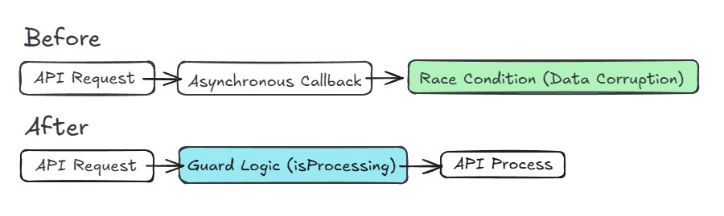

# Safe-Guard-Architect

**Protecting Business Logic in the Age of High-Efficiency AI.**

AIはもはやコードを書くだけの存在ではありません。Claude Mythosのような次世代モデルは、人間のエンジニアが数十年放置してきた脆弱性すら一瞬で見抜きます。

しかし、AIには決定的な死角があります。それは**「ビジネスの文脈に基づく、論理的な防壁の設計」**です。
私は、AIが生成したコードやアーキテクチャの論理的な欠陥を特定し、堅牢なシステムへ再設計する「Logic Auditor（論理監査官）」です。

---

## 核心的な価値：論理監査プロセス (Logic Audit)

AIが生成するコードには、しばしば「Race Condition（競合状態）」や「State Breakdown（状態崩壊）」といった、文法的には正しいが**ビジネスロジックを破壊する論理的な欠陥**が潜んでいます。

私は、単なる「修正」ではなく、再発防止を前提としたガードロジックの実装を行います。

### 監査・設計の対象
- **API連携**: AIが無視しがちなレート制限や冪等性（Idempotency）の欠如。
- **並行処理**: 競合状態が発生しやすい非同期処理の競合回避（Guard Logic）。
- **ステート管理**: 予期せぬ状態遷移によるデータ不整合の防止。

---

## 実績・事例 (Logic Proof)

* **Before**: AIが生成した脆弱なコード（論理欠陥あり）
* **After**: 監査およびガードロジックの実装により堅牢化されたコード

---

## なぜ「人間による論理監査」が必要か

1.  **Context over Syntax**: AIは文法を理解しますが、あなたのビジネスルール（制約）を理解しません。
2.  **Defensive Architecting**: 高性能AIによる脆弱性スキャンを想定し、多重防壁（Logic Guard）を設計します。
3.  **Truth Verification**: ハルシネーションを見抜き、真実に基づいたロジックのみを納品します。

---

## 依頼・お問い合わせ

論理的に堅牢なシステムを構築したい、あるいはAI生成コードの安全性を評価・監査したい企業・開発者の方は、下記よりお問い合わせください。

- **CrowdWorks**: [https://crowdworks.jp/public/employees/1451931?ref=share_url_wkprofile]
- **Contact**: [hinaenaworks@gmail.com]

---
*Logic Audited by Hinaena Works*
